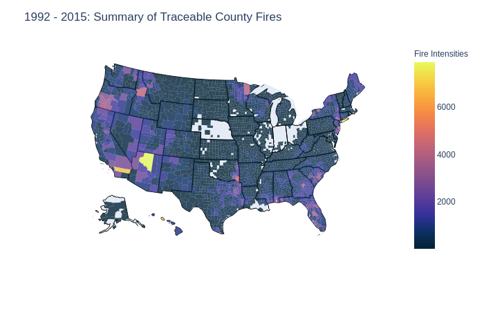
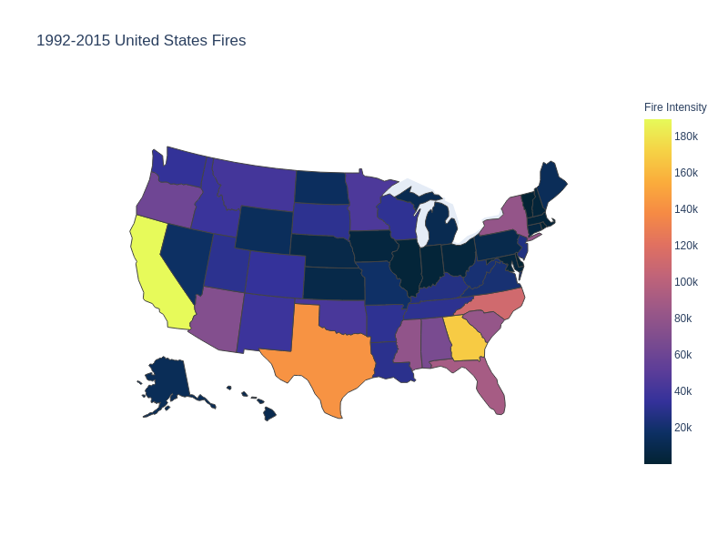
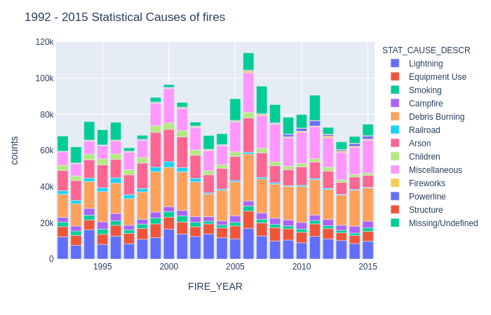
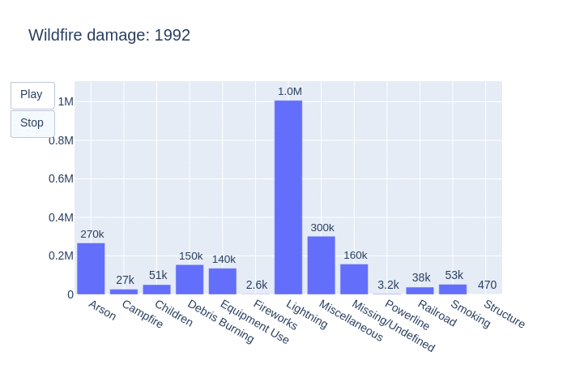
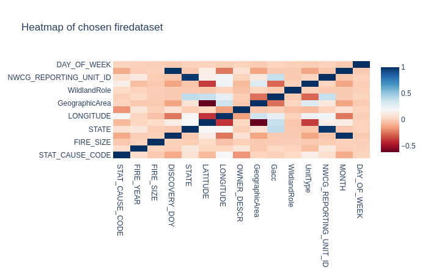
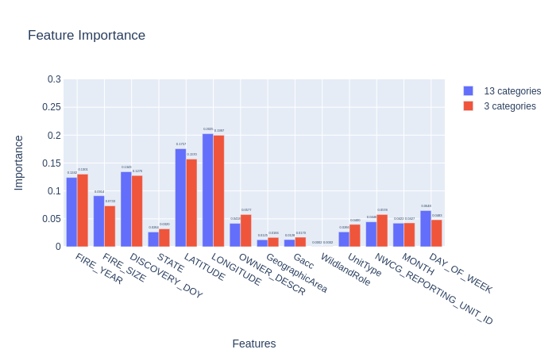
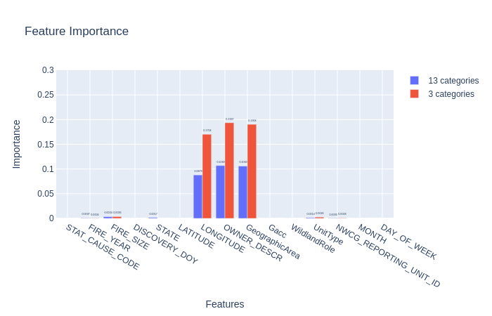
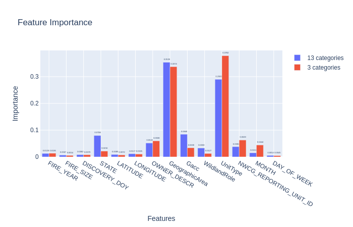

# Predicting Statistical Causes of Wildfires

## Table of Contents
1. [Goals](#Goals)
2. [Introduction](#Introduction)
3. [Notebook](#Notebook)
4. [Prediction](#Prediction)
5. [Graphs](#Graphs)
6. [Conclusion](#Conclusion)

## Goals
  1. Predict statistical causes of wildfires in the United States of America. [x]
  2. Conduct EDA of dataset. [x]
  3. Compare and evaluate different prediction models. [x]
  4. Find prediction values at various sample sizes. [ ]
  
## Introduction
  This dataset is a spatial database of historical wildfires in the United States from 1992 to 2015. The dataset is generated to support the Fire Program Analysis (FPA) system. In using this I aim to see if I can predict the statistical causes of wildfires? Moreover I also conduct Exploratory Data Analysis (EDA) to discover and observe frequencies of fires as their locations. 
  
  Kaggle Notebook Link: https://www.kaggle.com/jamesonthai/predicting-statistical-causes-of-historic-wildfire
  Kaggle Link: https://www.kaggle.com/rtatman/188-million-us-wildfires
  
  Citation: 
    Short, Karen C. 2017. Spatial wildfire occurrence data for the United States, 1992-2015 [FPAFOD20170508]. 4th Edition. Fort Collins, CO: Forest Service Research Data Archive. https://doi.org/10.2737/RDS-2013-0009.4
    
  If you don't want to view multiple links you can just check out my [Portfolio Website.](https://jamesonthai.github.io/portfolio/predicting_wildfires/) It will have everything migrated onto there and you can see [other projects](https://jamesonthai.github.io/portfolio/predicting_wildfires/) I've tackled as well! 
  
## Notebook
  You can download and run the notebook as it. Some of the required packages include plotly, json, pandas, sqlite3, scikit-learn, xgboost, random forests, and numpy.  

## Prediction
  The results are as follows, because the file size for the notebook is limited, I moved some of the other models to a different section which will be uploaded.
  | | Random Forests | XGBoost | Logistic Regression | SVM 
  |--|--|--|-- |-- |
  | 13 categories | 59% | 60% |31% | 27%|
  | 3 categories | 80% | 81% | 38% | 55%|
  
  - Specifically for the 3 categories in Random Forests, it crashed. Currently trying to find a workaround.

## Graphs
  -- IN Progress --
### U.S.A. County Fires
  These graphs look at the number of reported county fires from 1992 to 2015. 
  
  
   - This animated graph displays the number of reported county fires from 1992 to 2015 by year. The information is broken down by state and further broken down by the counties for every year.
  
  
   - This second graphs displays the total number of reported county fires from 1992 to 2015. 
   
### U.S.A. Wildfires by State

  
  
   - From 1992 to 2015, California has the highest number of reported wildfires followed by Georgia and Texas. This includes both causes known and unknown. 
  
### Statistical Causes of Fires

  
  
   - A colorful chart however it is pretty interesting to look up the makeup of reported fires causes by year. Each color scheme represents the statistical cause and all of these are stacked up to represent the total number of reported fires with a statistical cause. 
  
### Acres burned

  
  
   - Another animated chart however it visualizes how many acres were burned per year by each statistical cause. As the graph constantly shifts, so does the number of acres by each fire. 
  
### Correlations between predicted variables

  
  
   - Correlations between prediction variables, this information is used for the random forest tree. 

### Feature Importance

  #### Random Forests
  
  
  #### Logistic Regression
  
  
  #### XGBoost 
  
  
  #### SVM
  - Will be uploaded... file got corrupted >.>
  
  - Although they are hard to read, you can definitely read them all on my website for a more detailed analysis!
  
## Conclusion
  We can predict wildfires with around 60% accuracy across the 13 statistical causes. If we reduce the number of classification categories to natural, human, and other causes we can achieve around 81% accuracy! Ultimately fires in the United States are having an upward trend and are seemily becoming more frequent in states like California, North Carolina, and Arizona.
