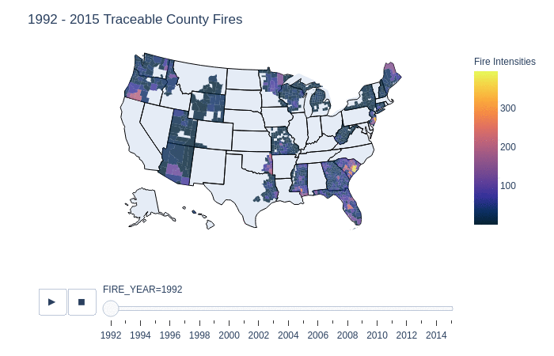

# Predicting Statistical Causes of Wildfires

## Goals
  1. Predict statistical causes of wildfires in the United States of America. [x]
  2. Conduct EDA of dataset. [x]
  3. Compare and evaluate different prediction models. [x]
  
## Introduction
  This dataset is a spatial database of historical wildfires in the United States from 1992 to 2015. The dataset is generated to support the Fire Program Analysis (FPA) system. In using this I aim to see if I can predict the statistical causes of wildfires? Moreover I also conduct Exploratory Data Analysis (EDA) to discover and observe frequencies of fires as their locations. 
  
  Kaggle Link: https://www.kaggle.com/rtatman/188-million-us-wildfires
  
  Citation: 
    Short, Karen C. 2017. Spatial wildfire occurrence data for the United States, 1992-2015 [FPAFOD20170508]. 4th Edition. Fort Collins, CO: Forest Service Research    
    Data Archive. https://doi.org/10.2737/RDS-2013-0009.4
  
## Running the Notebook
  You can download and run the notebook as it. Some of the required packages include plotly, json, pandas, sqlite3, scikit-learn, xgboost, random forests, and numpy.  

## Prediction
  The results are as follows, because the file size for the notebook is limited, I moved some of the other models to a different section which will be uploaded.
  | | Random Forests | XGBoost | Logistic Regression | SVM 
  |--|--|--|-- |-- |
  | 13 categories | 59% | 60% | | |
  | 3 categories | n/a | 81% | | |

## Graphs and Analysis
   -- In Progress of being recorded for markdown -- 
   
  
  
## Conclusion
  We can predict wildfires with around 60% accuracy across the 13 statistical causes. If we reduce the number of classification categories to natural, human, and other causes we can achieve around 81% accuracy! Ultimately fires in the United States are having an upward trend and are seemily becoming more frequent in states like California, North Carolina, and Arizona.
